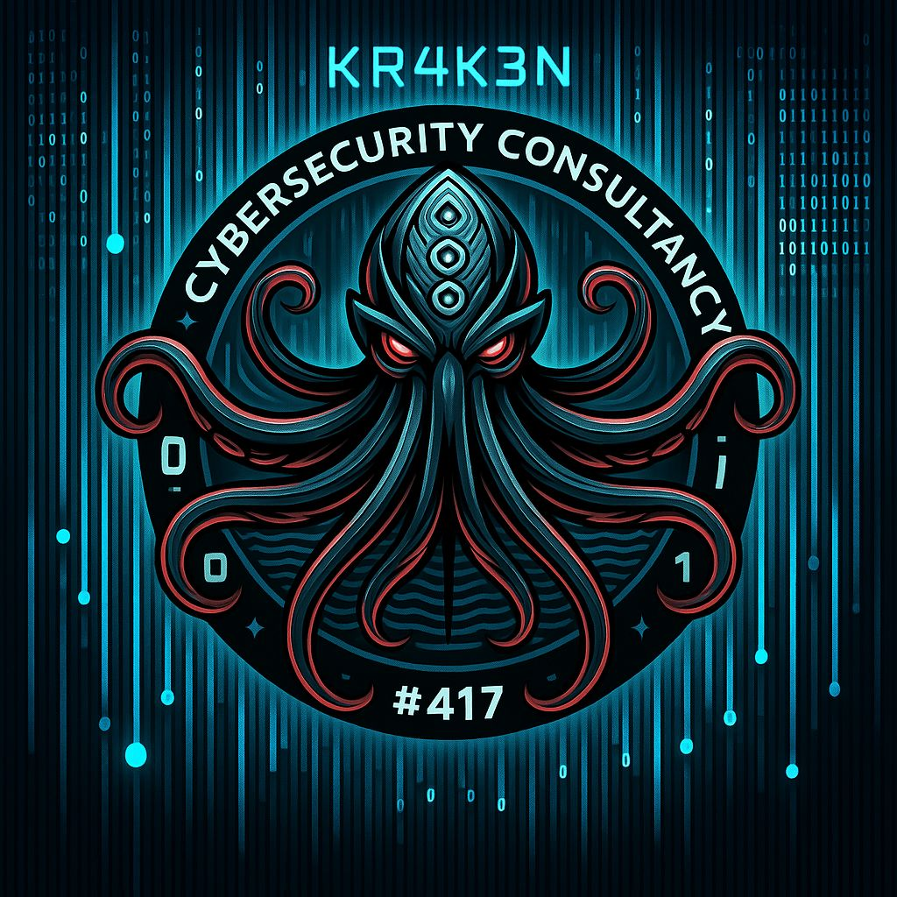

  

# KR4K3N Cybersecurity Consultancy 🐙

> Red Team | Threat Intelligence | Cyberwarfare

We are Kr4k3N. A cybersecurity consultancy born from the trenches of real-world cyberwarfare. Our specialty is operating in the invisible depths of the internet — where few have the courage or technical prowess to dive.

From the digital battlefield of the Armed Forces to the private sector, we deliver offensive and defensive solutions with surgical precision and a hacker mindset.

---

## 🔥 Services

- 🛠 Advanced Penetration Testing (Red Team)
  - Full chain: Reconnaissance, Exploitation, Pivoting, Post-Exploitation
  - Evasion techniques (OPSEC / OSEP-style)

- 🧠 Threat Intelligence (CTI)
  - Collection across Surface, Deep, and Dark Web
  - Analysis of IOCs, TTPs, APTs using MITRE ATT&CK and Diamond Model

- 🏭 Critical Infrastructure Security (ICS/SCADA)
  - Protection and threat simulation in industrial environments

- 🛡 Incident Response & Hardening
  - Containment, mitigation, and post-mortem analysis
  - Secure configuration of critical assets

- 🧩 Training & Simulations
  - Technical training for Blue and Red Teams
  - Strategic workshops for CISOs and executives

---

## 📂 Technical Portfolio

This repository contains public samples of our technical work. Available content:

| 📁 Folder | Content |
|----------|---------|
| `RedTeam-Labs/` | Simulated Red Team-style pentest reports |
| `ThreatIntel/` | Threat analysis examples, IOCs, and framework usage |
| `Tools-and-Scripts/` | Custom scripts and in-house tools |
| `Presentations/` | Talks and training materials on offensive security |
| `About/` | The story of Kr4k3N: from the Navy to the cyber market |

---

  

---

## 🤝 Who We Are

Former officer of the Brazilian Navy, specialized in Cyberwarfare and Information Security, with real-world experience in:

- Exercises such as UNITAS, Guardião Cibernético, and MCDC
- Advanced operations covering the full Cyber Kill Chain
- Training at elite military and civilian institutions, including OSCP and OSEP

Our current mission is to protect the private sector with the same level of rigor and excellence we used to defend critical national assets.

---

## 🌐 Contact

📧 Kr4k3N-CyberSec@proton.me
🔗 [linkedin.com/in/paulo-bernardo-4b13a7202](https://www.linkedin.com/in/paulo-bernardo-4b13a7202)  
🐙 Powered by Kr4k3N Cybersecurity Consultancy

---

  <i>"From the depths, we strike." — Kr4k3N</i>

